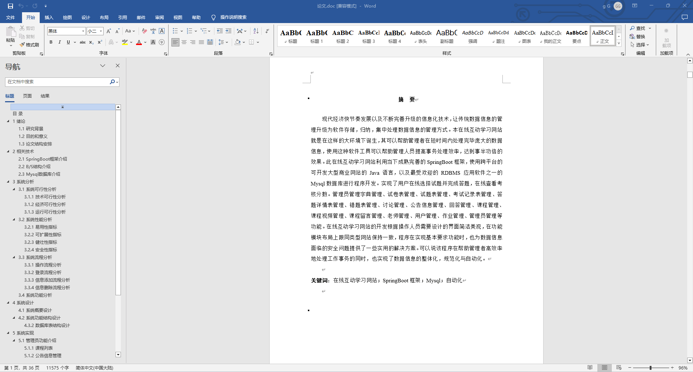
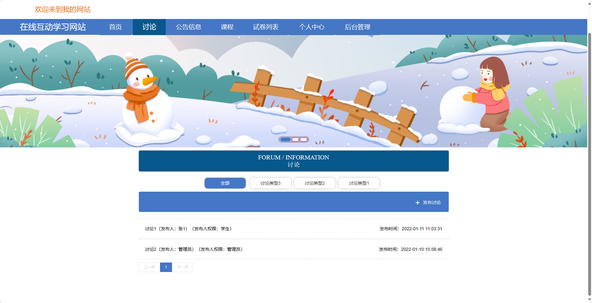
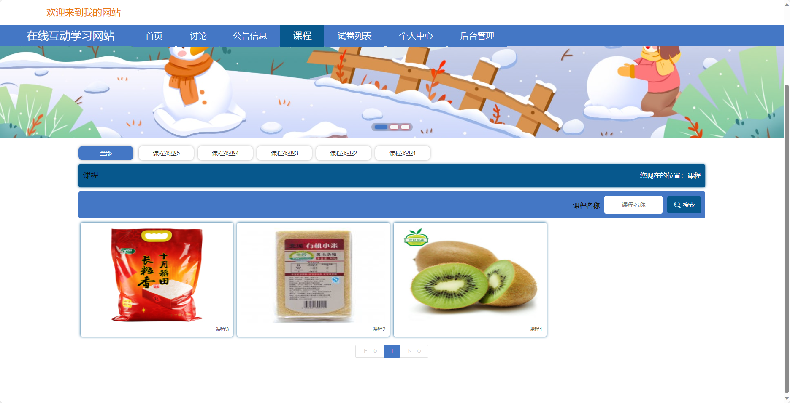
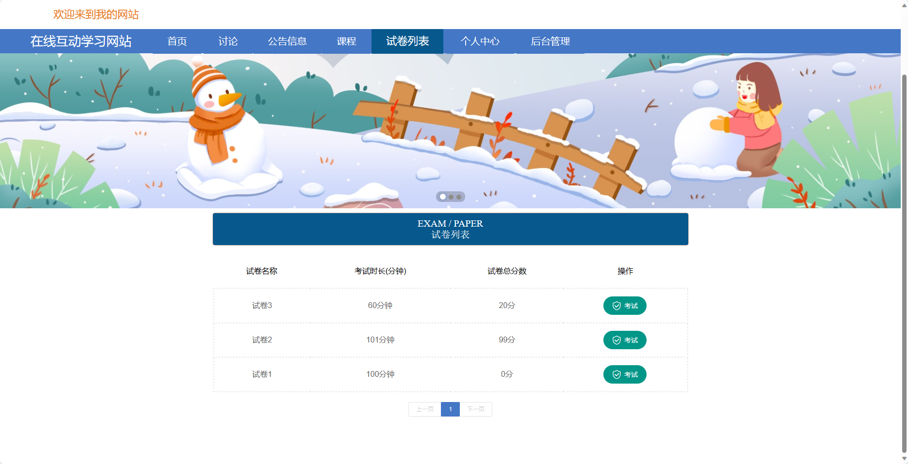
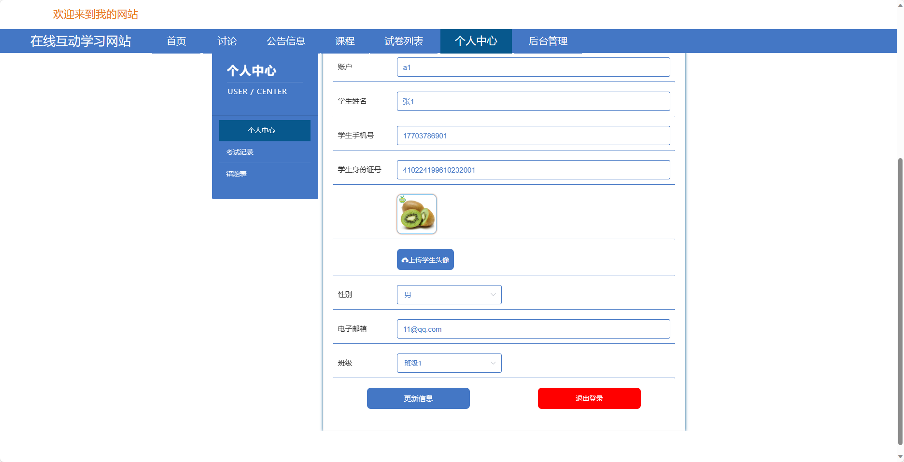
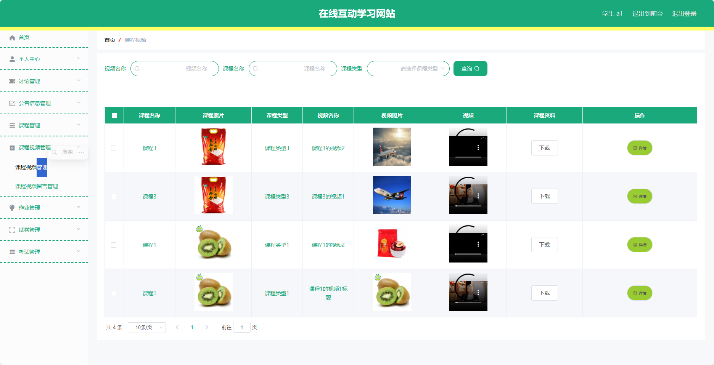
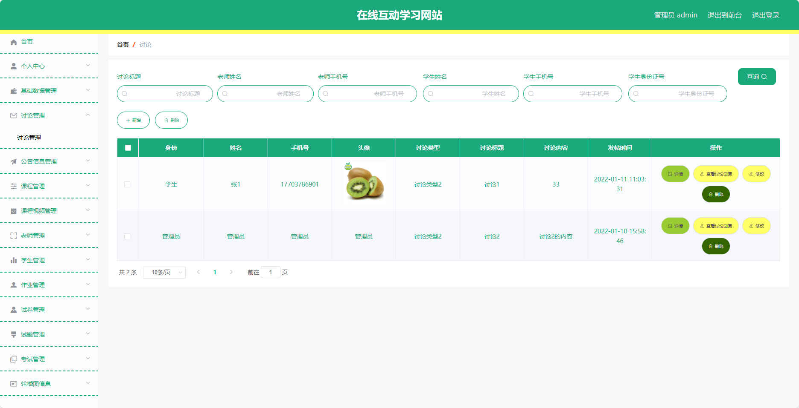

## 基于SpringBoot的在线互动学习网站(程序+报告)

###  获取sql数据库文件: 从戎源码网 (https://armycodes.com/) QQ: 386869957 QQ群: 377586148
###  所有系统地址: (https://github.com/YuLin-Coder/AllProjectCatalog) 
###  所有项目以及源代码本人均调试运行无问题 可支持远程安装部署调试、定制修改、代码讲解

## 项目介绍
基于SpringBoot的在线互动学习网站，系统包含三种角色：管理员、老师、学生,系统分为前台和后台两大模块，主要功能如下。

### 【管理员】:
- 个人中心：管理个人信息。
- 基础数据管理：管理系统的基础数据，如用户信息、课程信息等。
- 讨论管理：管理用户的讨论内容。
- 公告信息管理：发布和管理公告信息。
- 课程管理：管理课程的相关信息。
- 课程视频管理：管理课程视频资料。
- 老师管理：管理老师的信息和权限。
- 学生管理：管理学生的信息和权限。
- 作业管理：管理用户提交的作业信息。
- 试卷管理：管理试卷的相关信息。
- 试题管理：管理试题库的内容。
- 考试管理：管理考试安排和成绩。
- 轮播图信息：管理网站首页轮播图的展示内容。

### 【用户】:
- 个人中心：管理个人信息。
- 讨论管理：管理用户的讨论内容。
- 公告信息管理：发布和管理公告信息。
- 课程管理：管理课程的相关信息。
- 课程视频管理：管理课程视频资料。
- 作业管理：管理用户提交的作业信息。
- 试卷管理：管理试卷的相关信息。
- 考试管理：管理考试安排和成绩。

### 老师：
- 个人中心：管理个人信息。
- 讨论管理：管理课程讨论内容。
- 公告信息管理：发布和管理公告信息。
- 课程管理：管理所负责的课程信息。
- 课程视频管理：管理课程视频资料。
- 学生管理：管理学生的学习情况。
- 作业管理：管理学生提交的作业信息。
- 试卷管理：管理试卷的相关信息。
- 考试管理：管理课程相关的考试安排和成绩。

### 【前台】:
- 首页：展示网站的概况和热门内容。
- 讨论：用户可以参与课程讨论，交流学习经验。
- 公告信息：发布学校或网站的公告信息。
- 课程：展示各类课程的信息和内容。
- 试卷列表：列出所有可用的试卷供用户选择。
- 个人中心：用户可以管理个人信息和学习记录。

## 项目技术
- 编程语言：Java
- 数据库：MySQL
- 项目管理工具：Maven
- 前端技术：HTML、CSS、JavaScript、Jquery、Vue
- 后端技术：Spring、SpringMVC、MyBatis

## 运行环境
- JDK版本：JDK1.8及以上
- 开发工具：IDEA、Ecplise、Myecplise都可以
- 数据库: MySQL5.7及以上
- Maven：maven3.0及以上
- Node：14.14.0及以上

## 运行截图

